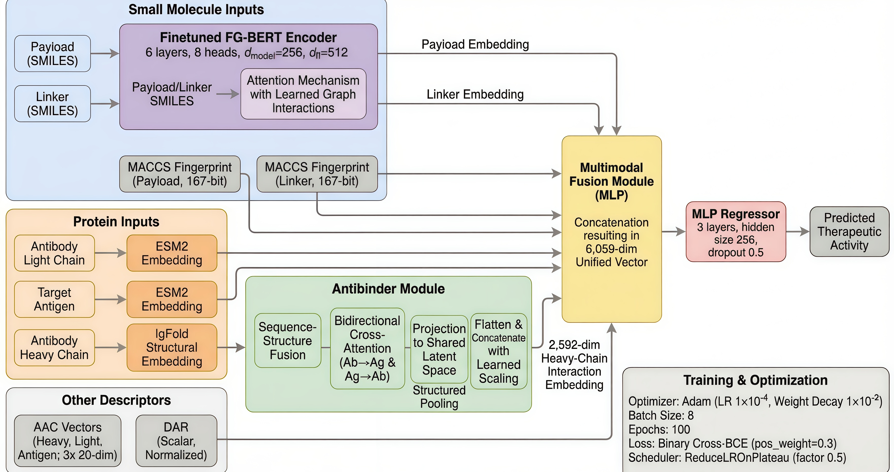

# **ABFormer: A Transformer-Based Multi-Modal Framework for ADC Activity Prediction**

ABFormer is a multi-modal deep learning architecture designed for activity prediction and in-silico triage of Antibody–Drug Conjugates (ADCs). Unlike prior models—most notably ADCNet—that treat antibodies, antigens, linkers, and payloads as independent features, ABFormer introduces a contextualized antibody–antigen binding representation derived from a pretrained interaction encoder. This interface-aware design improves generalization to unseen antibody–antigen pairs and prevents the over-optimistic behaviour observed in baseline models.

---

## **Overview**

Antibody–Drug Conjugates combine a monoclonal antibody, a cleavable linker, and a cytotoxic payload into a single targeted therapeutic. Their biological activity depends on the integrated behaviour of these components, with antibody–antigen binding constituting the primary determinant of cellular uptake. Traditional computational models overlook this interface and perform naïve feature concatenation, limiting their capacity to distinguish active from inactive ADCs.

ABFormer addresses this limitation via interaction-centric transfer learning: antibody heavy chains and antigens are passed jointly through a pretrained bi-cross-attention encoder (AntiBinder), producing biologically meaningful embeddings that capture binding interface context.

---

## **Key Contributions**

* **Contextualized Antibody–Antigen Interface Encoding**
  ABFormer uses a frozen AntiBinder encoder to extract 2592-dimensional interaction-aware embeddings integrating ESM-2 sequence features and IgFold structural signals.

* **Small Molecules Processing**
  Linker and payload isoSMILES strings are embedded using a PyTorch re-implementation of FG-BERT (256-dimensional each), jointly fine-tuned during training. MACCS fingerprints provide complementary handcrafted features.

* **Structured Protein Representations**
  Antibody light chain and antigen sequences are embedded via ESM-2 (1280-dimensional each). AAC descriptors are used for Antibody heavy chain, light chain and antigen. MACCS fingerprints provide complementary handcrafted features.

* **Multi-Modal Fusion Architecture**
  All features—including DAR—are concatenated into a 6059-dimensional vector and passed through an MLP prediction head (6059 → 256 → 256 → 1) with GeLU activations.

* **Selective Fine-Tuning Strategy**
  AntiBinder, ESM-2, and IgFold remain frozen; FG-BERT and the MLP are trainable. This avoids overfitting in the chemically sparse ADCdb dataset.

---

## **Architecture**



**Feature Encoders**

* AntiBinder (frozen): antibody–antigen interface → 2592-dim
* ESM-2 (frozen): light chain → 1280-dim, antigen → 1280-dim
* FG-BERT (fine-tuned): linker → 256-dim, payload → 256-dim
* MACCS (167-bit): linker, payload
* AAC descriptors: heavy chain, light chain, antigen
* DAR (scalar)

**Fusion**

* Concatenated 6059-dimensional vector
* Fully-connected MLP with GeLU activations
* Sigmoid output for binary activity classification

---

## **Installation**

```bash
git clone https://github.com/drugparadigm/ABFormer.git
cd ABFormer
git lfs pull

conda env create -f ABFormer_env.yml
conda activate ABFormer
```

---

## **Usage**

### **Random Split Training**

```bash
python train.py
```

### **Leave-Pair-Out Split Training**

```bash
python train.py --unique_split
```

### **Inference on New Samples**

```bash
python inference.py --seed="$seed" --json_path="data.json"
```

---
